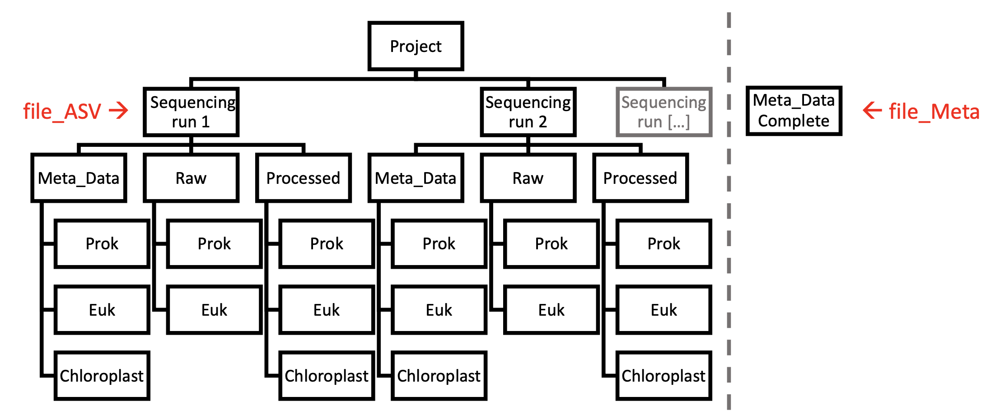

ExCom
================

## **Ex**plore **Com**munity - Handling Ecological Data

This repository contains basic functions for handling ecological
community data. The data is organized in lists which consist of two
different tables:

1.  Count\_Data - This table contains species/ASV-counts per station
    with taxa as rows and samples as columns. The first few columns are
    reserved for the taxonomical description of each row (including
    OTU-Identifier: Unique ID for ASV sequence).

*Here is an example Count\_Data table with a subset of all taxonomic
levels.*

| Kingdom  | Phylum         | Class                       | Species                          | 1-200-3 | 1-200-8 | 1-300-0.22 | 1-60-3 |
| :------- | :------------- | :-------------------------- | :------------------------------- | ------: | ------: | ---------: | -----: |
| Bacteria | Proteobacteria | Gammaproteobacteria         | uncultured marine bacterium      |       0 |       0 |          9 |      0 |
| Bacteria | Acidobacteria  | Blastocatellia (Subgroup 4) | Blastocatella bacterium          |      56 |      69 |         37 |      0 |
| Bacteria | Proteobacteria | Alphaproteobacteria         | OCS116 clade bacterium           |       0 |       0 |          0 |     50 |
| Bacteria | Proteobacteria | Deltaproteobacteria         | uncultured delta proteobacterium |       0 |       9 |          0 |      0 |

2.  Meta\_Data - This is a datatable in a tidy-data format, containing
    all environmental parameter for the various samples, as well as
    sample-context-variables such as Size\_Fraction.

*This is an example Meta\_Data table containing various environmental
parameter*

| Sample\_ID | Cruise | Station | Date\_Time          | Latitude | Longitude | Bot\_Depth | Depth | Province |  Press | Pot\_Temperature |
| :--------- | :----- | ------: | :------------------ | -------: | --------: | ---------: | ----: | :------- | -----: | ---------------: |
| 1-200-3    | SO248  |       1 | 2016-05-02 16:51:00 |     \-30 |       177 |       4268 |   200 | SPSG     | 201.47 |            16.97 |
| 1-200-8    | SO248  |       1 | 2016-05-02 16:51:00 |     \-30 |       177 |       4268 |   200 | SPSG     | 201.47 |            16.97 |
| 1-300-0.22 | SO248  |       1 | 2016-05-02 16:51:00 |     \-30 |       177 |       4268 |   300 | SPSG     | 302.28 |            15.09 |
| 1-60-3     | SO248  |       1 | 2016-05-02 16:51:00 |     \-30 |       177 |       4268 |    60 | SPSG     |  60.42 |            23.10 |

#### First Steps

The data we are working with are tables generated from the Qiime2
DADA2-pipeline (version 2019.4). Sequences are processed within this
pipeline into taxonomically annotated ASVs and their respective counts
for each sample. The pipeline is run in an artificial computing
environment to improve reproducibility of the results. For this purpose
we used Conda (version 4.7.12). More information about the bioinformatic
pipeline can be found
[HERE](https://github.com/jcmcnch/eASV-pipeline-for-515Y-926R).

To run the designed functions, it does not matter where the Count\_Data
is originating from, but files should be organized in the right
structure to get this system running. The file system is organized in a
way that fits to the kind of sequence data we are working with. If you
use DADA2 as a denoising algorithm, be aware that it creates an
indipendent error model for each sequencing run itself. That’s why its
useful to safe your data for each sequencing run separately. If your
Count\_Data originates from another source that does not have such
restrictions, feel free to reduce the folder structure to a single tree.

<div class="figure" style="text-align: center">



<p class="caption">

…

</p>

</div>

Each box represents a folder on your hard disk. You see the hierarchical
structure of your folders from top to bottom, all originating from the
same project. Second level contains all the indipendent sequencing runs
(as described earlier). Each of these runs has its own three subfolders:

  - Raw: Containing the raw ASV-table outputs (generated from Qiime2)
  - Processed: Here are the ASV-tables located that were already
    processed by “prepare\_raw()” to fit into the above shown format
  - Meta\_Data: In this folder you find the Meta\_Data file for that
    specific sequencing run, containing all the environmental data for
    the samples that were found in the raw ASV-tables.

This way of organization was chosen as we wanted to save the formated
Count\_Data independently from the raw tables to reduce computation time
of transforming the raw ASV table over and over again for each
R-Session. Also, it is important to keep the raw tables for
reproducability. The Meta\_Data folder is used here seperately from the
“raw” Meta\_Data to overcome the issue with the seperation into
different sequencing runs. If all runs are merged into the same
ASV-Table or your Count\_Data results from different methods, the “raw”
Meta\_Data will be used within this folder. But beware: You should use
the implemented functions to paste the Meta\_Data in here, as it also
checks the order of Sample\_IDs and accounts for missingness of samples.

The lowest level of folder hierarchy displays the different “Kingdoms”
of biological entities, i.e. Eukaryotes and Prokaryotes. As we use
universal primers to retrieve our sequencing data, we get 16S sequences
from Prokayrotes + Chloroplasts as well as 18S sequences from
eukaryotes. Within the bioinformatic pipeline those two groups are
seperated and treated individually. Also, the Chloroplasts and
Prokayrotes within the 16S data will be seperated as they use different
databases for taxonomic assignments (PhytoRef2 vs. SILVA132). It would
be anyway like comparing apples with pears if you would join all those
ASVs together into one table.

For that reason you find the following structure:

  - Raw contains “Prok” and “Euk” (Chloroplasts yet not seperated from
    the 16S sequences)
  - Processed contains “Prok”, “Euk” and “Chloroplasts” (now seperated)
  - Meta\_Data also contains a folder for each of these groups, as it
    might happen that some samples are excluded throughout the
    bioinformatic pipeline either for the 16S or 18S section, as they
    dont have enough high quality reads and will be excluded in the
    denoising step

Each folder contains the respective Count\_Data or Meta\_Data table. The
following functions depend on this structure as they are implemented in
a way that they are looking for the respective tables in such a folder
hierarchy.

#### Transform and Read Count\_Data

Function `prepare_raw()` transforms the raw ASV-table from Qiime2 into a
readable version. It requires the *taxonomy.tsv* and
*all-16S-seqs.with-tax.tsv* (*all-18S-seqs.with-tax.tsv*, respectively)
files in the “Raw” “Prok/Euk” folder to run. All it takes are the
locations of your “Sequencing Run” folder (marked in figure as
*file\_ASV*) and your raw Meta\_Data folder (in red as *file\_Meta*). It
transforms the taxonomy table into a readable version and pastes it
together with the Count\_Data to produce above shown version. Also,
Meta\_Data will be sliced to the samples and their order found in the
Count\_Data file.

``` r
file_ASV <- "Data/Example_Data/Pacific-Project/V4V5_Primerset/Pool_2/"
file_Meta <- "Data/Example_Data/Pacific-Project/Meta_Data/Meta_Data_Pacific_Sample_ID.tsv"

prepare_raw(file_ASV, file_Meta, confidence_lvl = 0.8, kingdom = "Prok")
```

    ## Raw tables converted into  Data/Example_Data/Pacific-Project/V4V5_Primerset/Pool_2/

``` r
prepare_raw(file_ASV, file_Meta, confidence_lvl = 0.8, kingdom = "Euk", DB = "PR2")
```

    ## Raw tables converted into  Data/Example_Data/Pacific-Project/V4V5_Primerset/Pool_2/

##### Taxonomical Confidence

Each taxonomical assignment was based on a classification by the *Naive
Bayesian Classifier*. This assignment gets bootstrapped for each taxa
and the resulting confidence-values will be displayed. The lower this
value, the higher the propability of an erroneous classification. As
default, this value is set to **0.8** which was also used throughout our
work.

#### Read the Data

To read the transformed tables, the function `data_select()` is
implemented, which just takes the same *file\_ASV* location and the
desired *Kingdom ID* (*“Prok”, “Euk”, “Chloroplast”*):

``` r
file_ASV <- "Data/Example_Data/Pacific-Project/V4V5_Primerset/Pool_2/"

datalist_Prok <- data_select(file_ASV, kingdom = "Prok")
datalist_Euk <- data_select(file_ASV, kingdom = "Euk")
datalist_Chloro <- data_select(file_ASV, kingdom = "Chloroplast")
```

#### Work with the Data

Now, the core features of this repository will come to work: It contains
wrapper for most data-wrangling functions to handle the datalist-format
of this kind of community data. Using these functions allows the user to
pipe a sequence of different actions one after another.

Example:

Imagine you want to run an ordination of your data, but before that you
would like to rarefy your dataset and use an abundance-filter to remove
rare (and propably spurious) ASVs. Then, pipe it directly into the
NMDS-wrapper. With this set of functions it would look like that.

``` r
datalist_Prok %>%
  rarefy_datalist(., rare_lim = 2000, drop = T) %>%
  filter_abundance(.) %>%
  filter_datalist(., .$Meta_Data$Size_Fraction != 0.22) %>%
  NMDS_ordination_datalist(.)
```

Using this kind of transformation processing, one can produce complex
data-processing tasks in an easy and readable way. Simple wrapper
functions for basic tasks such as filtering or transforming is a
powerful way to improve code generation and handling for this kind of
ecological data organization. This work is clearly related to the
brilliant dplyr package and its philosophy of doing data-science tasks.

This repository contains only wrapper functions that were relevant
throughout my work, but the concept of writing such simple functions for
datalists is easily adaptable and can be done by anyone who wishes to
use this way of ogranizing ecology data in a meaningful way.

#### datatables

Many programs such as ggplot have problems handling “non-tidy”
datatables such as a Count\_Data table. Also, how would you want to plot
scatterplots on the basis of multidimensional data?\! To overcome this
issue, it is crucial at some point in your analysis to melt your
multidimenional data into a simple datatable format. For this purpose,
some functions are implemented to do this task. As the dplyr package is
completely designed to work with datatables, wrappers such as they were
designed for the datalist format are no longer necessary and may be
substituted by their dplyr versions.

The fundamental function here is `create_datatable()` which takes the
datalists and a taxonomic level (such as *Class* or *Family*) and melts
the datalists into a datatable containing columns for the Sample\_IDs,
taxonomic groups within the chosen taxonomic level, and the community
proportion of the relevant combination of taxa and Sample\_ID.

``` r
datalist_Prok %>%
  create_datatable(., Family, otherThreshold = 0.02) %>%
  head(., n = 15) %>%
  select(1:5, 7:10) %>%
  knitr::kable(., digits = 2)
```

    ## Using Family as id variables

    ## Warning: Column `Sample_ID` joining factor and character vector, coercing into
    ## character vector

| Class                   | Sample\_ID | Proportion | Cruise | Station | Latitude | Longitude | Bot\_Depth | Depth |
| :---------------------- | :--------- | ---------: | :----- | ------: | -------: | --------: | ---------: | ----: |
| Actinomarinaceae        | 1-200-3    |       0.00 | SO248  |       1 |     \-30 |       177 |       4268 |   200 |
| AEGEAN-169 marine group | 1-200-3    |       0.00 | SO248  |       1 |     \-30 |       177 |       4268 |   200 |
| Alcanivoracaceae        | 1-200-3    |       0.12 | SO248  |       1 |     \-30 |       177 |       4268 |   200 |
| Ambiguous\_taxa         | 1-200-3    |       0.03 | SO248  |       1 |     \-30 |       177 |       4268 |   200 |
| Burkholderiaceae        | 1-200-3    |       0.06 | SO248  |       1 |     \-30 |       177 |       4268 |   200 |
| Chitinophagaceae        | 1-200-3    |       0.05 | SO248  |       1 |     \-30 |       177 |       4268 |   200 |
| Clade I                 | 1-200-3    |       0.02 | SO248  |       1 |     \-30 |       177 |       4268 |   200 |
| Cyanobiaceae            | 1-200-3    |       0.03 | SO248  |       1 |     \-30 |       177 |       4268 |   200 |
| Marinobacteraceae       | 1-200-3    |       0.07 | SO248  |       1 |     \-30 |       177 |       4268 |   200 |
| Sphingomonadaceae       | 1-200-3    |       0.06 | SO248  |       1 |     \-30 |       177 |       4268 |   200 |
| uncultured bacterium    | 1-200-3    |       0.03 | SO248  |       1 |     \-30 |       177 |       4268 |   200 |
| Others                  | 1-200-3    |       0.52 | SO248  |       1 |     \-30 |       177 |       4268 |   200 |
| Actinomarinaceae        | 1-200-8    |       0.00 | SO248  |       1 |     \-30 |       177 |       4268 |   200 |
| AEGEAN-169 marine group | 1-200-8    |       0.00 | SO248  |       1 |     \-30 |       177 |       4268 |   200 |
| Alcanivoracaceae        | 1-200-8    |       0.04 | SO248  |       1 |     \-30 |       177 |       4268 |   200 |

The datatable format is easy to use with ggplot functions but also
everyother function from the dplyr package. To improve compatibility,
all tables are stored in *tibble* format (also part of the *tidyverse*
package collection). A plotting process might look like that:

Imagine you would like to see all Roseobacter genera and how they differ
in abundance between different depths. The workflow would look like
that:

``` r
datalist_Prok %>%
  filter_datalist(., apply(select_if(.$Count_Data, is.numeric),2 ,sum) > 1000) %>%
  filter_by_taxa(., taxLvl = 5, taxa = "Rhodobacteraceae") %>%
  create_datatable(., Genus, otherThreshold = 0.1) %>%
  ggplot(., aes(x = Depth, y = Proportion, col = Class)) +
    geom_point()
```

    ## Using Genus as id variables


## Author:

Felix Milke

PhD Student at Institute for Chemistry and Biology of the Marine
Environment University of Oldenburg

Date: 25.03.2020
